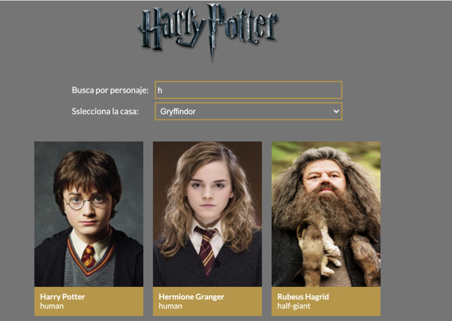
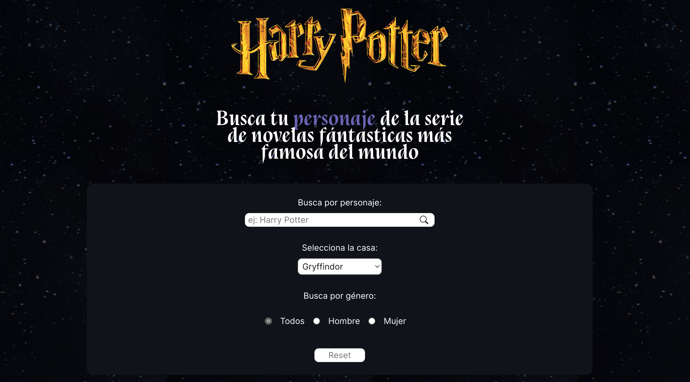

# Module: 3 REACT: final evaluation exercise

Hi there! 👋🏻 I am Enrica and this is my final evaluation exercise: Harry Potter Characters ⚡🧙.

### Example of the exercise

### Built With: 🛠
- HTML
- SCSS
- REACT

### Features to implement in the future 🤓 🔁
Use Routes, Route and Link

### Getting Started 💪🏼

Clone the repo:
* `https://github.com/Adalab/modulo-3-evaluacion-final-ErriGarcia.git`

Install NPM packages:
* `npm install`

Start the project: 
* `npm start`

### My exercise preview

### License
Distributed under the MIT License. See LICENSE.txt for more information.

### What I've learned 🧘‍♀️
> “To be calm is the highest achievement of the self.”

### Contact me 👩🏻‍💻
[Enrica Garcia](https://www.linkedin.com/in/enrica-garcia-69541a208/)